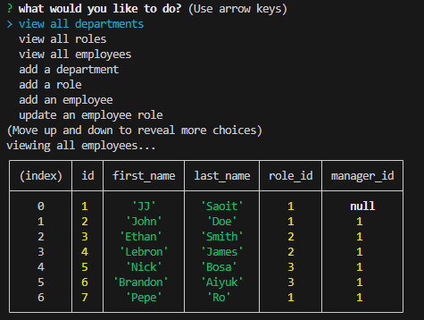

# sql employee tracker

#### by JJ Saout 

## Description

view/add/update your employee database

## Preview

## Table of Contents

- [Installation](#installation)
- [Usage](#usage)
- [Credits](#credits)
- [License](#license)

## Installation

install the node modules and with an npm start it should be ready.

## Usage

To keep track and be able to see your employee database

## Credits

Name: JJ Saoit
E-mail: saoitjensen@gmail.com
Github: jensenjamessaoit
Colaborators: N/A

## License

This project is licensed under [MIT](https://opensource.org/license/mit/).
